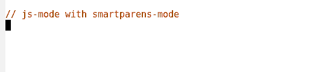
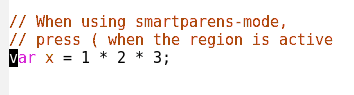
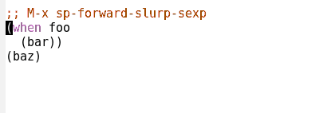
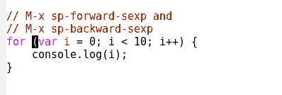

# Smartparens
[](http://melpa.org/#/smartparens)
[](http://smartparens.readthedocs.io/en/latest/?badge=latest)
[](http://stable.melpa.org/#/smartparens)
[](http://smartparens.readthedocs.io/en/latest/?badge=stable)
[](https://travis-ci.org/Fuco1/smartparens)
[](https://coveralls.io/github/Fuco1/smartparens)
[](https://www.paypal.com/cgi-bin/webscr?cmd=_s-xclick&hosted_button_id=A5PMGVKCQBT88)
[](https://www.patreon.com/user?u=3282358&ty=h)

<!-- markdown-toc start - Don't edit this section. Run M-x markdown-toc-generate-toc again -->
**Table of Contents**

- [Smartparens](#smartparens)
    - [Getting Started](#getting-started)
    - [Usage](#usage)
    - [Contributing](#contributing)
        - [Language Support](#language-support)
    - [Supporting Smartparens](#supporting-smartparens)
    - [Related Projects](#related-projects)

<!-- markdown-toc end -->

Smartparens is a minor mode for dealing with pairs in Emacs.

It can automatically insert pairs:



wrap, unwrap and rewrap pairs:



expand and contract pairs:



navigate pairs:



and much more!

## Getting Started

We generally target GNU Emacs version 24.3 and newer, however,
everything should work mostly fine on anything newer than version 24.

You can install smartparens from [MELPA](http://melpa.org/).  Once
installed, enable the [default configuration](https://github.com/Fuco1/smartparens/wiki/Default-configuration):

```elisp
(require 'smartparens-config)
```

You can now use smartparens with `M-x smartparens-mode`. To
automatically enable smartparens in a programming mode:

```elisp
;; Always start smartparens mode in js-mode.
(add-hook 'js-mode-hook #'smartparens-mode)
```

You may want to try `smartparens-strict-mode`. This enforces that
pairs are always balanced, so commands like `kill-line` keep your code
well-formed.

## Usage

Inside Emacs, `M-x sp-cheat-sheet` will show you all the commands
available, with examples.

There's also a
[great article demonstrating movement and editing in smartparens](http://ebzzry.io/en/emacs-pairs/)
and [extensive documentation in the wiki](https://github.com/Fuco1/smartparens/wiki).

## Contributing

We love pull requests. Please include tests. Smartparens uses
[ert-runner](https://github.com/rejeep/ert-runner.el) for testing. To
run all the tests, run:

```
$ cask exec ert-runner
```

Alternatively, you can open the individual files in Emacs, then
`M-x eval-buffer` `M-x ert`.

You can learn more about how we test on the [testing](https://github.com/Fuco1/smartparens/wiki/Testing) wiki page.

### Language Support

Smartparens has a default configuration that works well for most
languages. For language-specific behaviour, smartparens has a separate
`smartparens-FOO.el` file for every language and
`smartparens-config.el` loads these automatically.

## Supporting Smartparens

If you want to support this project, you can:

* Contribute code. If you have an idea that is not yet implemented and
  will benefit this project, feel free to implement it and submit a
  pull request. If you have any concerns whether your contribution
  will be accepted, ask beforehand. You can email the author or
  [start an issue](https://github.com/Fuco1/smartparens/issues/new) on
  the tracker.

* Contribute ideas. Even if you can't code Emacs Lisp, you can still
  contribute valuable ideas for other programmers to implement. Simply
  [start new issue](https://github.com/Fuco1/smartparens/issues/new)
  on the tracker and submit your suggestion.

* You can make a financial donation through
  [PayPal](https://www.paypal.com/cgi-bin/webscr?cmd=_s-xclick&hosted_button_id=A5PMGVKCQBT88)
  or [Patreon](https://www.patreon.com/user?u=3282358&ty=h).  If you
  like smartparens and can spare a modest amount on a donation, feel
  free to do so.  These donations are expressions of your gratitude
  and are used for my personal "rewards" (books, games, music etc.).
  You can also gift me a game on
  [Steam](http://steamcommunity.com/profiles/76561198265034071/wishlist)
  or buy something on
  [Amazon](http://www.amazon.com/gp/registry/wishlist/2I8DOQH8OZEUR).
  Regardless of the donations, smartparens will always be free both as
  in beer and as in speech.

## Related Projects

Other Emacs projects that deal with pairs include:

* [autopair](https://github.com/capitaomorte/autopair)
* [textmate](http://code.google.com/p/emacs-textmate/)
* [wrap-region](https://github.com/rejeep/wrap-region)
* [electric-pair-mode](http://www.emacswiki.org/emacs/ElectricPair)
* [paredit](http://emacswiki.org/emacs/ParEdit)

Smartparens aims to provide a superset of these features, in all
programming languages.
